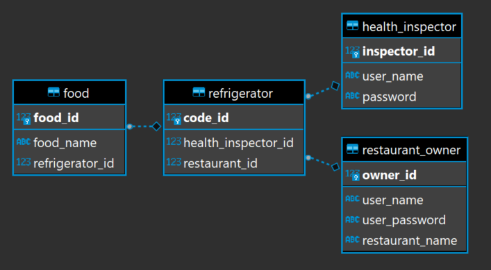

## **PROJECT NAME: Restaurant Owner App (Project 0)**

DUE DATE: 8/11/2021

### SCENARIO:

    You live in a city that’s famous for its food. Year-round crowds of people from
    around the world visit just for a chance to try your city’s cuisine. As a result,
    restaurant owners around your city buy MULTIPLE refrigerators in order to store
    large quantities of food and serve as many customers as possible.
    Restaurant owners have difficulty keeping track of their stock and are asking you
    for your help. They task you with creating a Java application that they can use to
    organize and keep track of their stored food

•   The application should allow 2 types of accounts to be created:
**RESTAURANT** and **HEALTH INSPECTOR**. Different account types will have different options available to it.

• The application should interact with the account user through the console using the Scanner class.

• The user should be able to decide which task they’d like to perform. When the user has completed a task, the application’s event loop should give
the user the option of performing a new task. “Logout” and/or “Exit” should be an option.

• All information should be persisted (saved) using JDBC and a PostgreSQL DB

• You should use the DAO design pattern for DB connectivity

• Reasonable test coverage is expecting using J-Unit.
    o Folks, I’m not asking for 100% test coverage; but give me at least 5-10 tests to demonstrate that you are capable of using J-Unit

## Restaurant Accounts:

• As a restaurant, you should be able to register a new RESTAURANT account with a username and password.

• As a restaurant, you should be able to add refrigerators to your account. You should be able to add new or remove refrigerators at any time. If you delete a fridge, the food from the fridge is placed into another fridge (you may not delete your last fridge).

    o Fridges may only hold a maximum of FIVE food items.
    o Each fridge object should remember which restaurant purchased it.
• As a restaurant, you should be able to deposit food into a fridge. This will more than likely require the user to use the console to type in a new food item.

• As a restaurant, you should be able to withdraw food from a fridge

• As a restaurant, you should be able to transfer food between fridges (restaurant may have one or more fridges)

• As a restaurant, you should be able to give one or more health inspectors permission to a particular fridge.

    o Since you assign health inspectors to each fridge individually, each fridge may have a different list of health inspectors 
    (even fridges in the same restaurant may have a different list of inspectors)
    o So, a single fridge may be accessed by many inspectors (one to many relationship) 
    AND a single inspector may access many fridges (one to many relationship).

• Basic validation should be done

    o Trying to withdraw (or transfer) food that is not present in this specific fridge
    o Making sure any specific fridge doesn’t exceed 5 items

## Health Inspector Accounts:
• As a health inspector, you should be able to view ALL fridges you have been given access to

    o ONLY the fridges you have been given permission to access, no other fridges…
• As a health inspector, you should be able to remove the contents from all fridges you have been given access to.

## Reminders
    **Please take the deadline seriously
    **Do NOT spend too much time stuck on a single blocker without asking a batchmate for help.

##Tips on how to start
If you are having trouble wrapping your head around how to start, her is my preference for starting project 0:
1. Start by creating your tables in SQL, you will need some way to store   accounts, fridges and food.
2. Create a package for your models. Create all the classes that will be used to simply hold information about each ACCOUNT and each FRIDGE. These
   objects should do NOTHING but hold information about a single account/fridge.
   
    a. These classes should basically only have variables, constructors, getters/setters, and a toString.
    b. These models will likely closely resemble the tables you created in step 1
3. Create a package for your dao classes. These classes sole purposes are to retrieve and send data to the database utilizing JDBC.
4. Next create a package that will deal with the business logic of the application. These classes will hold methods like “addNewFood()”,
   “addNewFridge()”, “getAllFridgesGivenAccount()”, etc…
   
    a. These classes will have references to your dao classes.
5. Create a package that’s sole purpose is for interacting with the user. In this class you’ll first set up a simple event loop that allows the user to enter
   different commands to perform different tasks.
   a. These classes shouldn’t have state functionality yet; JUST focus on the event loop and the user interaction here
   b. The classes in step 4 will have the actual functionality so these classes will most like have references to the classes stated in step 4.
###   NOTE:
This is not the only way to start the project but if you don’t know how to start you could use this guideline

## Database Model Diagram

## Menu Diagram
    LOGIN  MENU >    

        (1)  Restaurant Owner
            (a) List All Fridges
            (b) Add New Fridge
            (c) Remove Fridge
            (d) List All Foods
            (e) Deposit Food
            (f) Withdraw Food
            (g) Transfer Food
            (h) Assign Health Inspector

        (2)  Health Inspector
            a) List of Assign Fridges
            b) Remove Food Item

        (0) Exit